# Detection Transformer (DETR)

PyTorch reimplementation of the Detection Transformer model described in the paper ["End-to-End Object Detection with Transformers"](https://arxiv.org/abs/2005.12872) from Carion et al., 2020.

<p align="center">
  
</p>
<p align="center"><b>Gif:</b> Inference using DETR model - trained on Pascal VOC.</p>

*NOTE: This repository implements a down-scaled version of DETR and therefore differs from the orginal implementation. DETR was trained on Pascal VOC instead of COCO to minimize computation cost and time.*

## Architecture

<p align="center">
  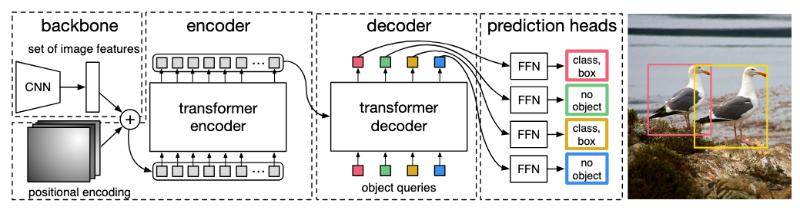
</p>
<p align="center"><b>Figure 1:</b> The baseline architecture for DETR. Taken from Carion et al., 2020</p>

## Usage

```python
import torch
from src import DETR


detr = DETR(
    n_classes=90 + 1,      # 90 classes + no-object class
    num_queries=100,
    d_model=256,
    encoder_layers=6,
    encoder_heads=8,
    decoder_layers=6,
    decoder_heads=8,
    ff_dim=2048,
    dropout=0.1,
)

x = torch.randn(1, 3, 800, 1333)
logits, boxes = detr(x)

print(logits.shape)  # [1, 100, 92]
print(boxes.shape)   # [1, 100, 4]
```

## Experimental setup

DETR was trained from scratch on the Pascal VOC dataset on a single RTX 3060 TI GPU. Training took ~63 hours (2.6 days). I trained on Pascal VOC trainval07+12 (16551 images) and evaluated on Pascal VOC test07 (4952 images).

My experimental setup in detail is given by:

* OS: Fedora Linux 42 (Workstation Edition) x86_64
* CPU: AMD Ryzen 5 2600X (12) @ 3.60 GHz
* GPU: NVIDIA GeForce RTX 3060 ti (8GB VRAM)
* RAM: 32 GB DDR4 3200 MHz

All settings and hyperparameters are listed below in the table.

| Setting and Hyperparameters | Original DETR | This implementation |
|---|---:|---:|
| CNN backbone | ResNet-50 | ResNet-50 |
| Encoder layers | 6 | 6 |
| Decoder layers | 6 | 6 |
| Number of object queries | 100 | 25 |
| Number of classes | 91 (COCO) | 21 (+ 1 no-object) |
| Learning rate (transformer) | 1e-4 | 1e-4 |
| Learning rate (backbone) | 1e-5 | 1e-5 |
| Weight decay (transformer) | 1e-4 | 1e-4 |
| Weight decay (backbone) | 1e-4 | 1e-4 |
| Optimizer | AdamW | AdamW |
| Batch size | 16 | 4 |
| Training epochs | 300 | 150 |
| Image size | shorter side 800, max side 1333 | (640, 640) |
| Max tokens | depends on feature map size | 400 |
| Gradient clipping | 0.1 | 0.1 |
| Dataset | COCO | Pascal VOC |

*Note: At epoch 100 the learning rate for both the transfomer and the backbone was multiplied by 0.1.*

## Results

Below are the training results in more detail:

| Size (pixels) | mAP50 (val) | mAP50-95 (val) | Params (M) |
| ------------- | --------- | ----------- | ---------- |
| 640x640 | 0.7563 | 0.4920 | 41.5 |

<p align="center">
  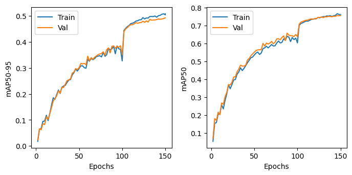
</p>
<p align="center"><b>Figure 2:</b> mAP50-95 (left) and mAP50 (right) of DETR during training on PASCAL VOC.</p>


| DETR detection | DETR detection (+ decoder attention) |
| -- | -- |
| 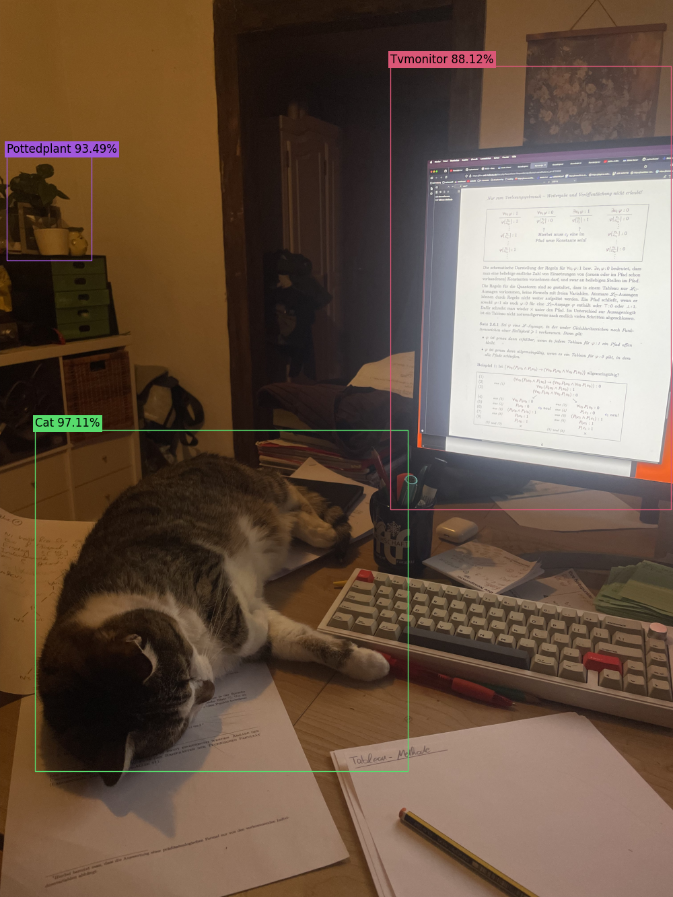 | 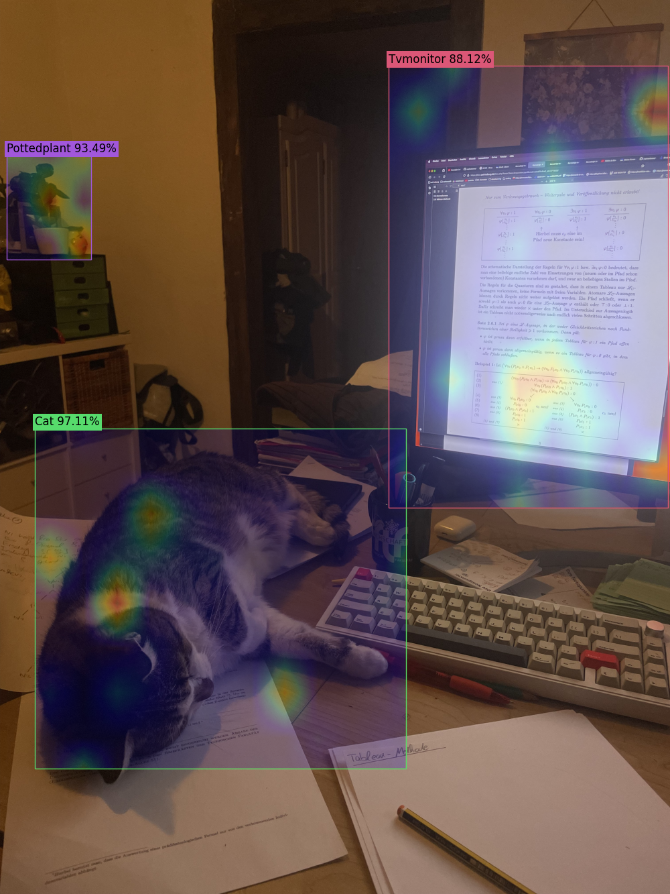 |
| 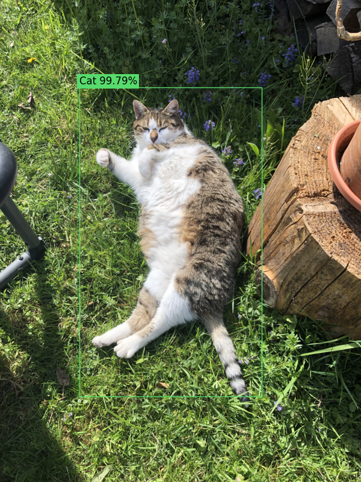 | 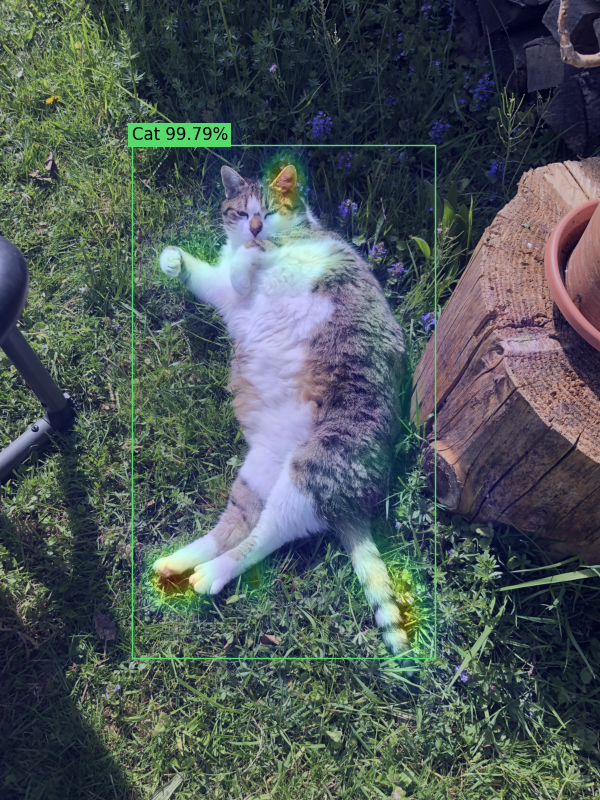 |
| 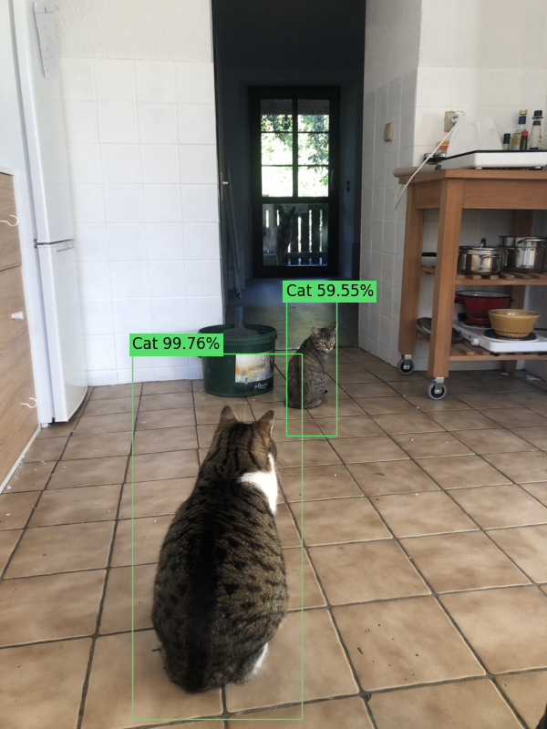 | 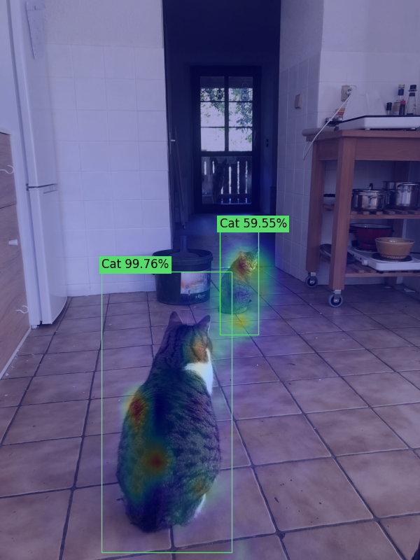 |
| 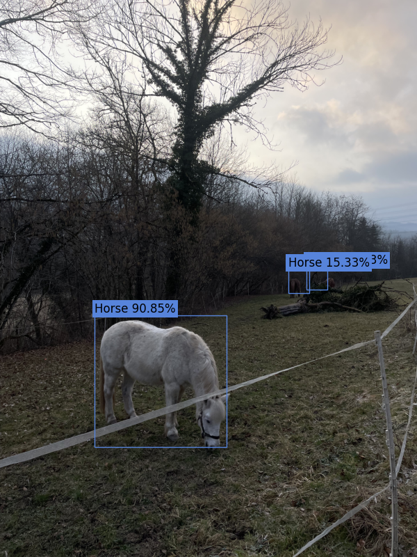 | 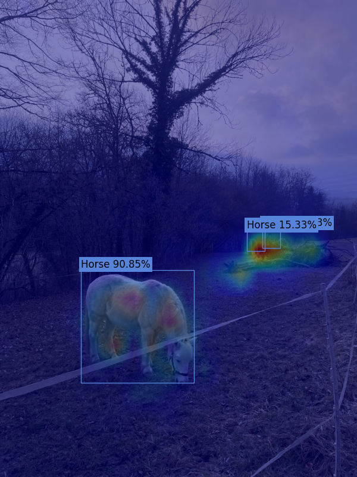 |
| 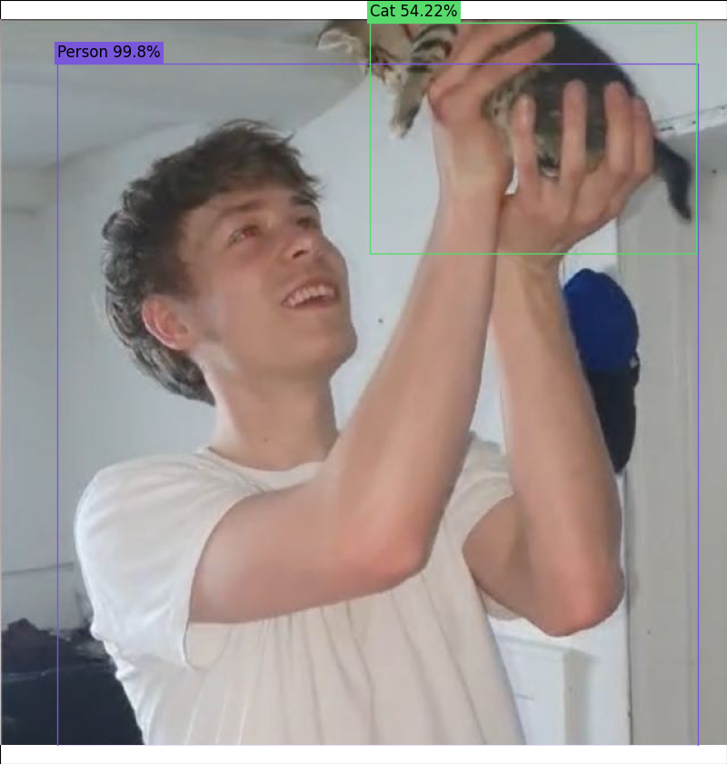 | 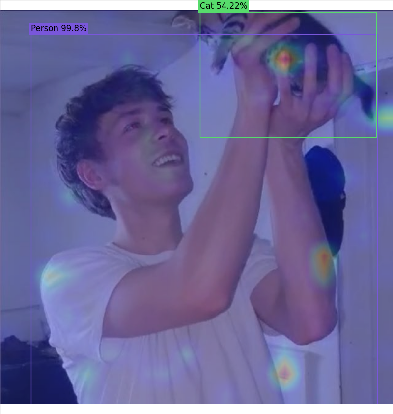 |

## Citations

```bibtex
@misc{carion2020endtoendobjectdetectiontransformers,
      title={End-to-End Object Detection with Transformers}, 
      author={Nicolas Carion and Francisco Massa and Gabriel Synnaeve and Nicolas Usunier and Alexander Kirillov and Sergey Zagoruyko},
      year={2020},
      eprint={2005.12872},
      archivePrefix={arXiv},
      primaryClass={cs.CV},
      url={https://arxiv.org/abs/2005.12872}, 
}

@misc{everingham2010pascal,
      title={The PASCAL Visual Object Classes (VOC) Challenge},
      author={Mark Everingham and Luc Van Gool and Christopher K. I. Williams and John Winn and Andrew Zisserman},
      year={2010},
      eprint={0909.5206},
      archivePrefix={arXiv},
      primaryClass={cs.CV}
}
```